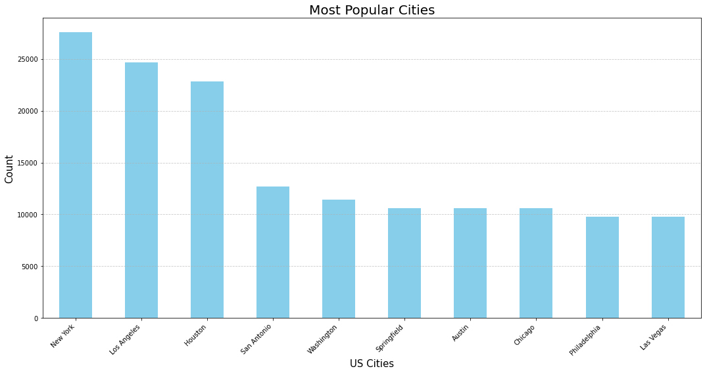
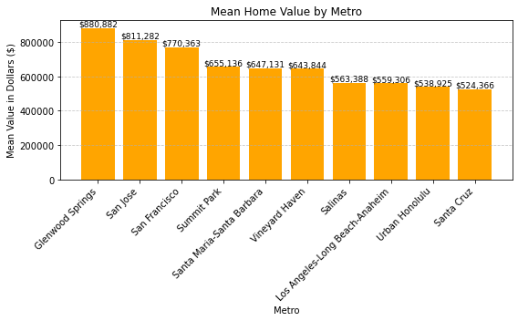
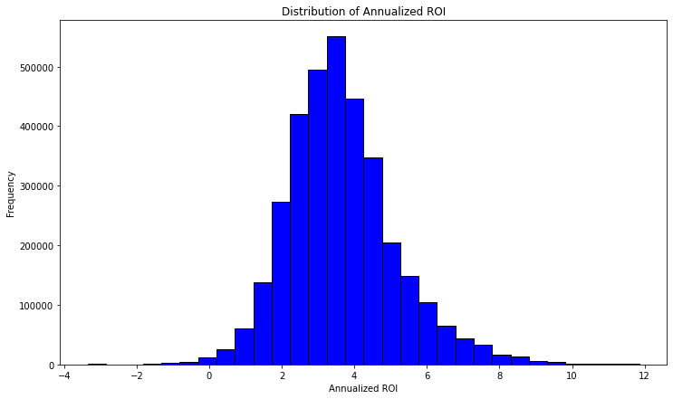
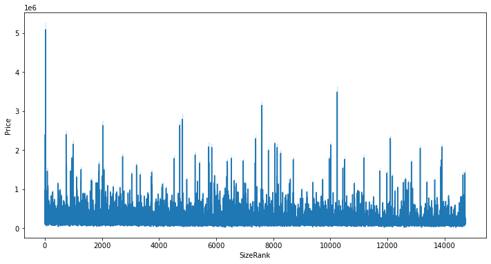
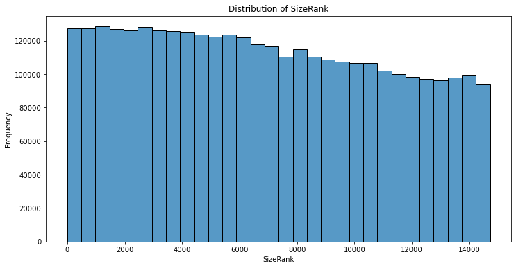

**Time Series Modelling of Real Estate Value**

**Problem Statement**

The goal of this project is to support a real estate development company in identifying high-potential areas in the United States for constructing residential properties. Through time series analysis of historical housing data from Zillow, we aim to uncover trends and predict future housing prices, guiding investment decisions to maximize financial returns.

**Project Overview**

Our project focuses on leveraging historical median house prices from Zillow to support a real estate development company in identifying high-potential areas for investment. We aim to uncover trends and predict future housing prices to guide investment decisions and maximize returns.

**Business Understanding**

Investing in real estate is both dynamic and lucrative, requiring meticulous research and strategic planning. Our stakeholder, a fictional real estate investment company, seeks to identify the top five most promising postal codes (zip codes) for future investments. Utilizing historical data from Zillow, we will analyze trends to highlight these promising areas.

**Methodology**

**Data Preprocessing**

Data Cleaning Data Transformation
**Explorative Data Analysis**

Univariate, Bivariate, and Multivariate analysis Visualization

**Statistical Analysis**

**Modeling**

Model Selection Model Training and Validation Model Evaluation

**Forecasting and Results Interpretation**

Forecast Future Values Interpret Results

**Data Description**

The dataset used for this project was downloaded from a GitHub repository, which originally sourced the data from Zillow housing data. The dataset spans from April 1996 to April 2018 and provides detailed monthly home value data for a wide range of regions across the United States.
It encompasses a total of 14,723 rows and 272 columns, structured in a wide format.
The information contained within the columns is as follows;

RegionID: A unique identifier assigned to each region.
RegionName: The name of the region, which also represents the ZIP code.
City: The city where the region is situated.
State: The state in which the region is located.
Metro: The metropolitan area associated with the region, if applicable.
CountyName: The county where the region is found.
SizeRank: A numerical rank indicating the size of the region relative to other regions in the dataset.

**Exploratory Data Analysis (EDA)**

Here we will explore the different features of the dataset to gain a better understanding of the data. We will use data visualization to uncover trends and patterns. We will use Feature Engineering to create new features from existing ones and perform One-Hot Encoding on categorical variables that we will require for analysis.

**Univariate Analysis**

**Top 20 most frequent cities in the dataset**

This plot shows the top 20 most frequent cities in the dataset.

**Mean home value by  Metros*

Thebar chart shows the top 10 metropolitan areas with the highest mean home values. It helps in comparing the average home values across different metro areas and identify where the highest values are concentrated.

**Distribution of Annualized ROI*

Most investments seem to yield an annualized ROI of around 4%, indicating a potentially good profit margin for the majority of real estate investments.

 **Bivariate**

**Price vs Size Rank*

**Distribution and Trends:* The plot shows a large number of data points with prices fluctuating across different size ranks. There are noticeable peaks in certain areas, which might indicate properties with significantly higher prices at specific size ranks.

**Variability:** The plot demonstrates high variability in property prices, suggesting that factors other than size significantly influence property prices. This could include location, property features, market conditions, and more.

**size Rank Over Time*

This plot shows how SizeRank changes over time. It helps in understanding if the popularity or ranking of ZIP codes changes and how that might relate to home prices or other factors over time.

**Distribution of size Rank *

**Distribution Shape:** The histogram shows a decreasing trend from left to right, with the highest frequency on the left side. This suggests that lower `SizeRank` values (which might indicate smaller or less desirable properties, depending on the dataset’s context) are more common in the dataset.

The histogram indicates a right-skewed distribution, where most properties have lower `SizeRank` values, and fewer properties have higher `SizeRank` values. This could imply that smaller or less desirable properties are more prevalent in the dataset.

**MODELLING**

We then created 6 models, 3 ARIMA and 3 Prophet models, and determined that the best-performing model was the ARIMA (3, 0, 1) model. The table below shows the performance of each model.

Model		ARIMA(1,0,1)		ARIMA (1,0,3)	
	ARIMA (3,0,1)	
	Prophet-1	
	Prophet-2	
	Final-Prophet
												
RMSE		31.27		22.82		0.40		87.45		87.45		87.45
												
MAE		27.31		18.51		0.35		77.20		77.20		77.20

**Recommendations**

To potential real estate investors, we recommend investing in the following states, New York, New Jersey, Colorado, Carlifornia and Washington DC, from the analysis these states showed promising Returns on Investment. The best zipcodes were found within the states mentioned, these are, 11211 - Brooklyn, New York, 11222 - Brooklyn, New York, 11216 - Brooklyn, New York, 7302 - Jersey City, New Jersey and 11215 - Brooklyn, New York.

**Conclusion**

1.Prioritize High-ROI Areas: Focus on high-ROI regions like DC and Brooklyn's 11211 for significant portfolio allocation.

2.Diversify Investments: Balance your portfolio by including properties from high-ROI areas and stable markets to mitigate risks.

3.Analyze Outliers: Include some outlier properties after thorough analysis to take advantage of unique investment opportunities.

4.Regional Focus: Invest in zip codes with consistent growth trends like 11211, 11222, 11216, and 07302, while considering the risk tolerance and desired growth rate.

**Group Members**
- **Joan Nyamache**
- **Marion Achieng**
- **Eugene Marius**

---

---

 

---
